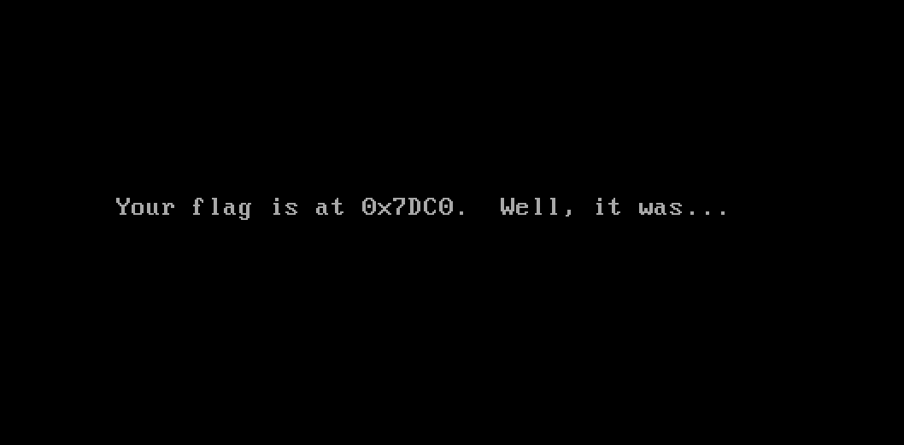
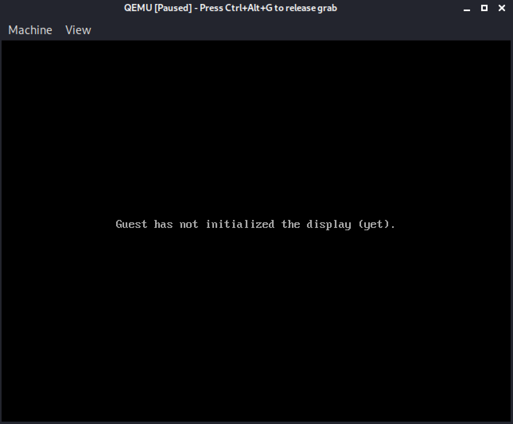
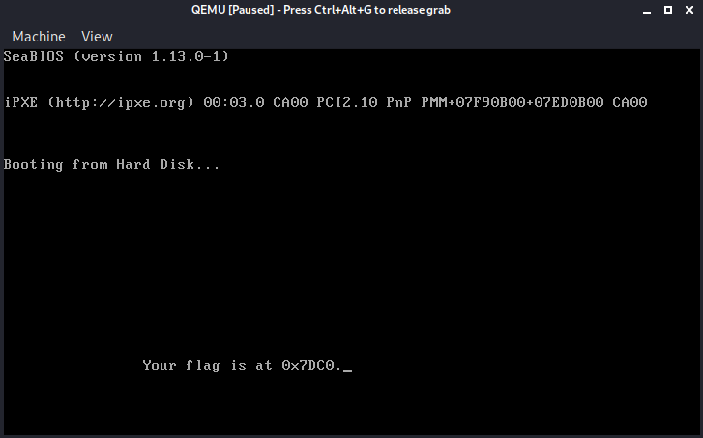
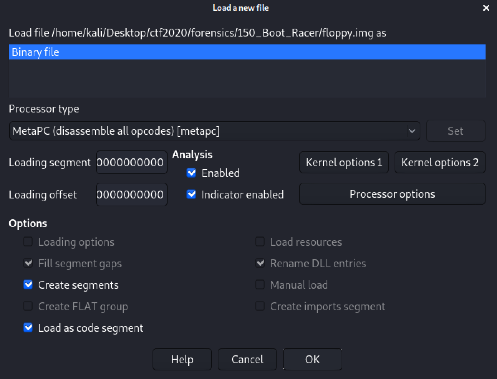
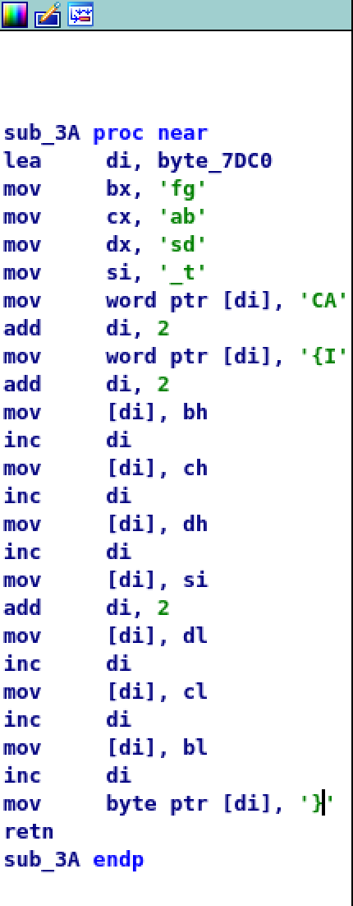
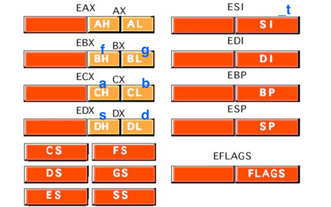

# Boot Racer

## Challenge
* Category: Forensics
* Points: 150

We've found one last floppy disk [image](https://challenge.acictf.com/static/f9e5870daff8022a93badbe9e11ffa82/files.tar.gz) that boots, but it looks like we're just being toyed with at this point.

### Hints
* Maybe the messages aren't lying. Are they printed at the same time?


## Solution

### Tools
* qemu
* gdb
* (optional) IDA - free version


Ok. Lets see what we are delaing with. Follow the previous boot challenge steps. When we boot the floppy we see the following output.


So we now know the flag was at `0x7DC0` at some point during the boot. We are going to try two methods. First is stepping the boot process by starging the image with qemu and attaching to it with gdb. Method 2 (credit `bobbyD` for the walkthrough) uses the free version of IDA to analyze the flag image for the flag.

### Method 1

Lets start qemu but make it wait for gdb. Check out these parameters.
```
-S              freeze CPU at startup (use 'c' to start execution)
-s              shorthand for -gdb tcp::1234
```
This will allow us to step the boot process and watch `0x7DC0` memory location.
```
qemu-system-x86_64 -s -S floppy.img
```
We should be paused here:


Now start gdb and then have it attach to the

start gdb and use `target remote localhost:1234` to attach to qemu
```
$ gdb
(gdb) target remote localhost:1234
```
Set our watch point for the memory address `0x7DC0`. gdb will pause when something enters that address
```
(gdb) watch *0x7DC0
Hardware watchpoint 4: *0x7DC0
(gdb) x/4s 0x7DC0
0x7dc0: ""
0x7dc1: ""
0x7dc2: ""
0x7dc3: ""
(gdb) c
Continuing.
```

Out watchpoint hit. Now lets print the contents of the memory address (and some surround addresses). `x` prints in gdb. `4s` means 4 units and try to treat as a c string.
```
Hardware watchpoint 1: *0x7DC0

Old value = 0
New value = 17217

Hardware watchpoint 2: *0x7DC0

Old value = 0
New value = 17217

Hardware watchpoint 3: *0x7DC0

Old value = 0
New value = 17217

Hardware watchpoint 4: *0x7DC0

Old value = 0
New value = 17217
0x0000000000007c4e in ?? ()
(gdb) x/4s 0x7DC0
0x7dc0: "AC"
0x7dc3: ""
0x7dc4: ""
0x7dc5: ""
(gdb) c
Continuing.
```

We have the begining of our flag. So lets continue. gdb will pause as more enteres that watch address.
```
... (im truncating the output)
(gdb) x/4s 0x7DC0
0x7dc0: "ACI{"
0x7dc5: ""
0x7dc6: ""
0x7dc7: ""
```

gdb paused again. We have a bit more of the flag.

```
(gdb) c
Continuing.
... (im truncating the output)

(gdb) x/4s 0x7DC0
0x7dc0: ""
0x7dc1: ""
0x7dc2: "I{fast_dbg}"
0x7dce: ""
(gdb)
```
Also at this point, we see the message in the boot window that was passed over too quickly without stepping the boot.


So. We can assemble the flag and get **ACI{fast_dbg}**

### Method 2

Shout-out to `bobbyD` for this awesome approach.

Ok. Start IDA and open the floppy.


Next select 16-bit for the disassembly.


To start, lets look at our address `0x7DC0` in the assembly it has a data reference. Click the data reference `sub_3A` in the left side functions window to open it in a new tab.


This is what the data reference intitially looks like


Thats a bunch of hex. Lets convert it to text by clicking each orange part and type `r` on your keyboard. The output is below.


Now we are getting somewhere. We see what looks like parts of the flag. We just have to figure out what order it needs to go. Lets read some assembly instructions.

* The `mov bx, 'fg'` means **move** the ascii `fg` to the 16-bit CPU register **bx**
* The `mov cx, 'ab'` means **move** the ascii `ab` to the 16-bit CPU register **cx**
* The `mov dx, 'sd'` means **move** the ascii `sd` to the 16-bit CPU register **dx**
* The `mov si, '_t'` means **move** the ascii `_t` to the 16-bit CPU register **si**

Now that we have the flag spread across the registers, imagine they look something like this.


The rest of the instructions are going to move the ASCII text into our memory location `Ox7DC0`.
* `mov word ptr [di], 'CA'` means move the two bytes converted to ASCII **CA** to the memory location where the pointer stored in register di `0x7DC0`
* `Add di, 2` means increase the value stored in di by 2 (we are making room for the next addition of ASCII)
* `mov word ptr [di], '{I'` means move the two bytes converted to ASCII **CA** to the memory location where the pointer stored in register di `0x7DC0`

So far we have added `CA` and `{I` to di, but if we remember endianness, it is read in reverse. So they would read `AC` and `I{` or `ACI{`

Now. `bh`, `ch`, `dl`, `cl`, `bl` are all 8-bit sub-registers of the parent registers we populated above. The next 15 instructions increase the space available in `di` and then move the ASCII from a sub-register to the `di` register.
* `Add di, 2` increase `di` by 2

* `move [di], bh` means move to the `di` register the value in `bh` which is ASCII `f`

* `inc di` increment position in `di` by 1

* `move [di], ch` means move to the `di` register the value in `ch` which is ASCII `a`

* `inc di` increment position in `di` by 1

* `move [di], dh` means move to the `di` register the value in `dh` which is ASCII `s`

* `inc di` increment position in `di` by 1

* `move [di], si` means move to the `di` register the value in `si` which is ASCII `_t`. Now remember endianness, you would read this as `t_`

* `add di, 2` increase `di` by 2

* `move [di], dl` means move to the `di` register the value in `dl` which is ASCII `d`

* `inc di` increment position in `di` by 1

* `move [di], cl` means move to the `di` register the value in `cl` which is ASCII `b`

* `inc di` increment position in `di` by 1

* `move [di], bl` means move to the `di` register the value in `bl` which is ASCII `g`

* `inc di` increment position in `di` by 1

* `move byte ptr [di], '}'` means move the bytes converted to ASCII `}` to the memory location where the pointer stored in register `di`

If we put this all together we get the flag: **ACI{fast_dbg}**
